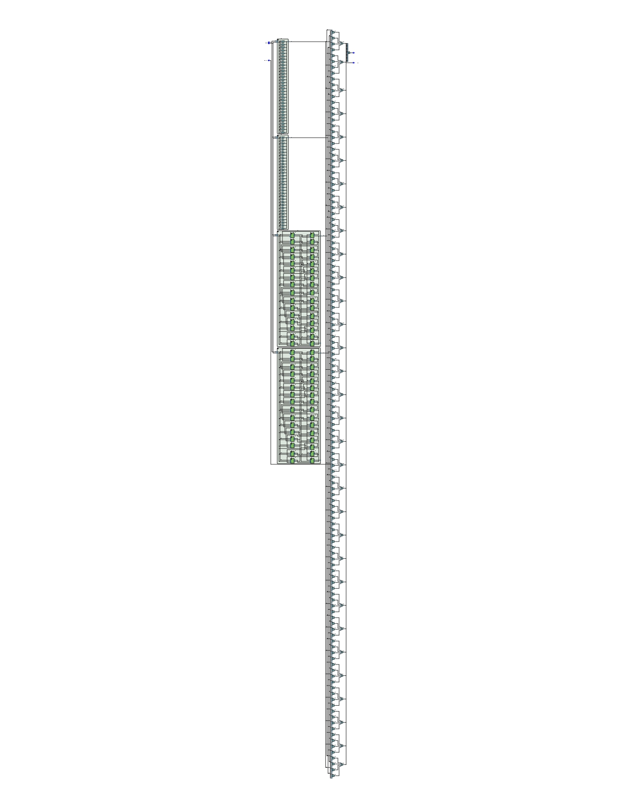

# ALU
A Unidade Lógica e Aritmética é o componente responsável por realizar as operações de soma e subtração, além de operações lógicas como OR e AND. 

A ALU executa operações diversas a depender do código de operação que recebe como entrada.

``⚠️ Para mais informações sobre os respectivos códigos de operação, observe o README da Unidade de Controle e do Controle da ALU ⚠️ ``

Abaixo é possível visualizar o circuito sintetizado da ALU:

