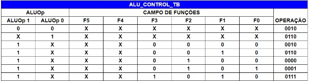
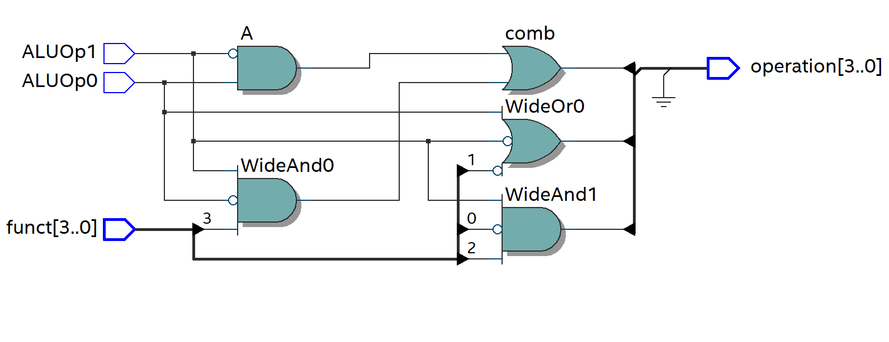

# ALU Control

A ALU Control é o circuito responsável pelo controle das operações realizadas pela ALU. Consiste em um bloco combinatório que possui uma entrada de 4 bits e determina qual operação deve ser efetuada, de acordo com a instrução.

Abaixo está a tabela verdade da ALU Control

0010 -> soma

0110 -> subtração

0000 -> AND

0001 -> OR

O circuito sintetizado da ALU Control está disponível abaixo:

