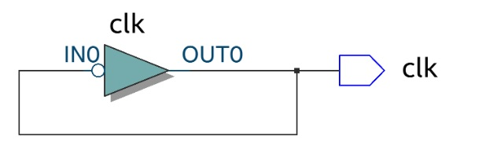

# Clock Generator

O clock generator é uma estrutura básica e fundamental presente no RISC-V, de modo que irá ditar o período das operações realizadas no processador, ou seja, apresenta comportamento oscilatório. Assim, a cada quantidade determinada de tempo (que pode ser manipulada no código em Verilog), um sinal de alta tensão é enviado para uma saída registrada.
O circuito do Clock Generator sintetizado pode ser visualizado abaixo:

