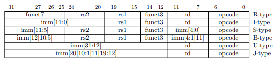

# Immediate Generator

O Immediate Generator tem como função, juntar determinados bits da instrução, a depender da Operation Code, essa palavra selecionada então será fornecida como saída. Observe a estrutura das instruções, o immediate (imm), que é um número de entrada, é retirado dos 32 bits de instruções e setado como output.

Abaixo, o circuito sintetizado do Immediate Generator:

