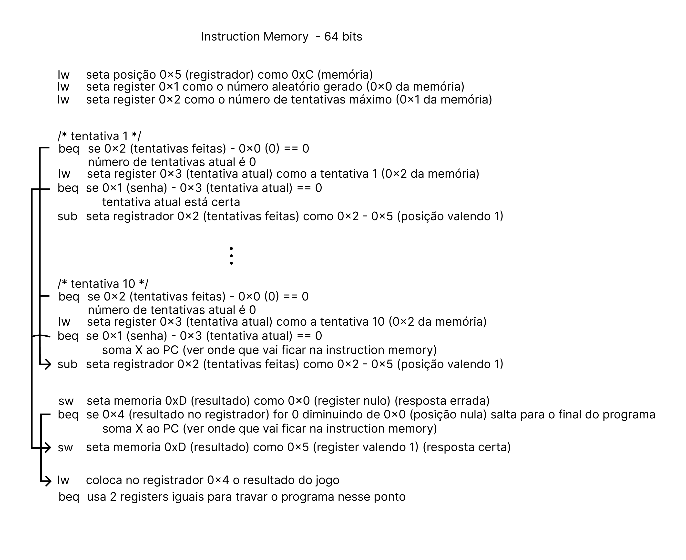
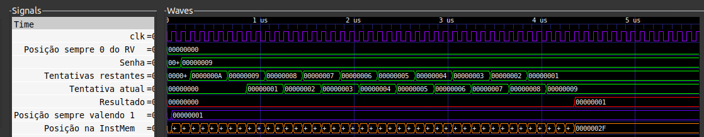

# Memória de Instruções

A Memória de Instruções é o local onde a sequência de instruções a serem executadas pelo processador são armazenadas. 
No nosso caso, o Exercício-Programa 0 da disciplina de MAC2166 da Escola Politécnica da Universidade de São Paulo, um exercício introdutório para entrega requerido aos alunos de Engenharia de Computação no primeiro semestre de 2022.
No final deste arquivo, apresentam-se os resultados das simulações do EP.

<p align="center">
💻 Aqui está o código utilizado 💻
 </p>

```
#include <stdio.h>

int main()
{
    /* Declaracao e inicializacao (boa pratica) de variaveis */
    int semente, quantidadeTentativas, senha, tentativa;
    semente = 0;
    quantidadeTentativas = 0;
    senha = 0;
    tentativa = 0;


    printf("Bem vinda(o) ao Numle\nDigite a semente para sortear a senha (0 a 10000): ");
    scanf("%d", &semente);

    printf("Quantidade de tentativas (1 a 10): ");
    scanf("%d", &quantidadeTentativas);

    /* Assinala o valor da senha aleatoriamente baseado na semente escolhida pelo usuario */
    semente = semente % 134456;
    senha = ((8121 * semente + 28411) % 134456) % 10;

    /* Loop ate que a quantidade de tentativas termine */
    while (quantidadeTentativas > 0) {
        printf("Digite a tentativa (0 a 9): ");
        scanf("%d", &tentativa);
        if (tentativa == senha) {
            printf("Voce acertou! A senha eh de fato %d", senha);
            return 0;
        } else {
            quantidadeTentativas = quantidadeTentativas - 1;
        }
    }
    printf("Voce perdeu! A senha era %d", senha);

    return 0;
}

```

Aqui embaixo está a versão em código de máquina para o RISC-V de 32 bits
```
00000000110000000010001010000011
00000000000000000010000010000011
00000000000100000010000100000011
00000100000000010000100101100011
00000000001000000010000110000011
00000110001100001000000001100011
01000000010100010000000100110011
00000100000000010000001101100011
00000000001100000010000110000011
00000100001100001000010001100011
01000000010100010000000100110011
00000010000000010000111101100011
00000000010000000010000110000011
00000100001100001000000001100011
01000000010100010000000100110011
00000010000000010000101101100011
00000000010100000010000110000011
00000010001100001000110001100011
01000000010100010000000100110011
00000010000000010000011101100011
00000000011000000010000110000011
00000010001100001000100001100011
01000000010100010000000100110011
00000010000000010000001101100011
00000000011100000010000110000011
00000010001100001000010001100011
01000000010100010000000100110011
00000000000000010000111101100011
00000000100000000010000110000011
00000010001100001000000001100011
01000000010100010000000100110011
00000000000000010000101101100011
00000000100100000010000110000011
00000000001100001000110001100011
01000000010100010000000100110011
00000000000000010000011101100011
00000000101000000010000110000011
00000000001100001000100001100011
01000000010100010000000100110011
00000000000000010000001101100011
00000000101100000010000110000011
00000000001100001000010001100011
01000000010100010000000100110011
00000000000000000010011010100011
00000000000000000000001101100011
00000000010100000010011010100011
00000000110100000010001000000011
00000000000000000000000001100011
```
E é isso.

Peraí, achou que não íamos explicar que transformação foi essa? :)

Aqui embaixo está um esquema de para a passagem feitas da Memória de Dados para o programa no decorrer no programa.

<p align="center">
 
</p>

Foram traduzidos bit a bit cada uma das instruções add, sub, and, or, lw, sw e beq. As especificações dessas instruções estão em outras apresentações neste repositório.
Sendo assim, uma versão intuitiva, quase que o Assembly do Exercício programa, está exposto abaixo.


<p align="center">
💻 Programar em Assembly é trabalhoso 💻
 </p>
 <p align="center">
 Caso precise saber melhor o que cada uma das instruções está fazendo, analise o código (os comentários são interessantes), os diagramas deste README e as definições do Instruction Set do RISC-V. Link no ícone a seguir.
 </p>
  <p align="center">
 <a href="https://riscv.org/wp-content/uploads/2017/05/riscv-spec-v2.2.pdf">
 
 </a>
 </p>
 
 
<p align="center">
 
</p>

## Resultados das simulações

Primeiro, simula-se uma situação na qual o número de tentativas é 5, sendo elas, em sequência:
``4 3 1 5 2``

Abaixo está a primeira simulação de onda:
<p align="center">
 
</p>

Observando a Posição na InstMem (valor armazenado no Program Counter), pode-se saber a instrução atual sendo realizada no processador. Sendo assim, na figura anterior, pode ser visualizado até a instrução 3.

Percebe-se que os valores foram carregados nos registradores como esperado nas bordas do clock.

Ademais, abaixo encontra-se uma visualização mais ao longe da simulação do programa. Percebe-se que foram testados os valores 

<p align="center">
 
</p>

