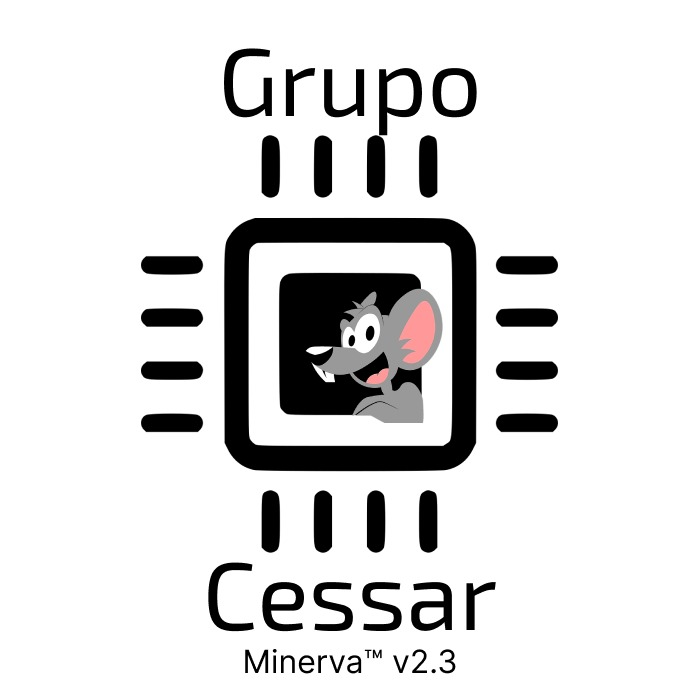

# Olá, bem-vindo ao repositório do grupo 3 (Grupo Cessar)!

Oi, tudo bem? Nós somos alunos do 1° ano de Engenharia de Computação da Escola Politécnica da USP no ano de 2022. A gente compõe o grupo 3 da disciplina PCS-3115 (Sistemas Digitais I).
Neste repositório você encontrará uma implementação de um processador com a arquitetura RISC-V na linguagem de descrição de hardware Verilog.

Abaixo você poderá ver um diagrama detalhado que descreve o funcionamento do circuito

