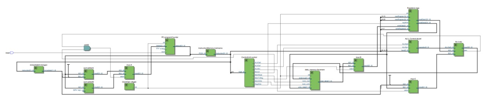
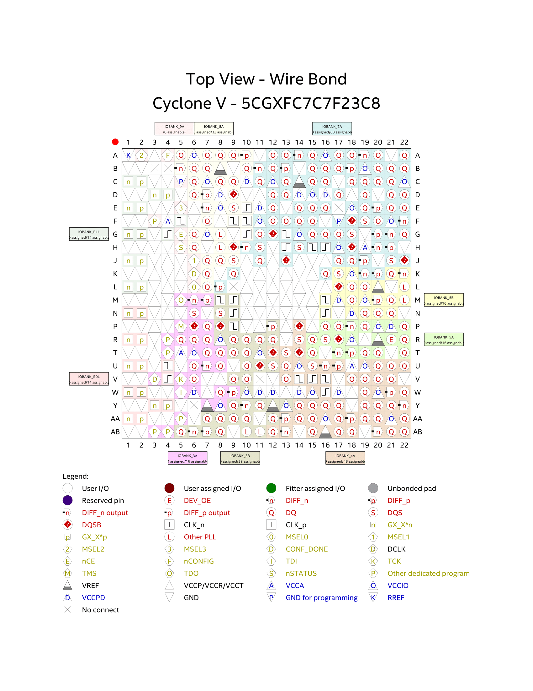

  

  
  
  

  
  
  
  

# Olá, bem-vindo ao repositório do grupo 3 (Grupo Cessar)!

Oi, tudo bem? Nós somos alunos do 1° ano de Engenharia de Computação da Escola Politécnica da USP no ano de 2022. 
Os integrantes do grupo são: Celso Tadaki Sinoka, Henrique Gregory Gimenez, João Felipe de Souza Melo e Lucas Suzin Bertan. Nós compomos o grupo 3 da disciplina PCS-3115 (Sistemas Digitais I).
Neste repositório você encontrará uma implementação de um processador com a arquitetura RISC-V na linguagem de descrição de hardware Verilog. O objetivo final deste projeto consiste em aplicar esse processador para rodar um jogo de advinhação, que foi desenvolvido como exercício em uma disciplina anterior (MAC2166 - Introdução à Computação).
Os resultados da simulação desse programa, assim como sua implementação no RISC-V, estão na pasta da Instruction Memory. Vai lá conferir :)

Abaixo você poderá ver um diagrama detalhado que descreve o funcionamento do circuito:

Aqui, o circuito sintetizado:

Também foi feita uma implementação para FPGA, representada abaixo:

## Instruções
As instruções que o processador feito pelo grupo utiliza são:
|  Instrução  | Tipo |  Descrição |
|-------------|---|---|
| add  | R  | Soma dois registradores (rs1 e rs2) e armazena o resultado no registrador rd  |
| sub   | R | Subtrai dois registradores (rs1 e rs2) e armazena o resultado no registrador rd  |
| and | R  | Faz a operação lógica and bitwise (bit a bit) entre dois registradores (rs1 e rs2) e armazena o resultado no registrador rd  |
| or | R  | Faz a operação lógica or bitwise (bit a bit) entre dois registradores (rs1 e rs2) e armazena o resultado no registrador rd   |
| lw (load word) | S  | carrega uma palavra da Memória de Dados da posição rs1 + offset e armazena o valor lido no registrador rd |
| sw (store word) |  I | armazena uma palavra do registrador rs2 na posição da Memória de Dados rs1 + offset |
| beq (branch if equal) |  B | Compara o conteúdo dos registradores rs2 e rs1. Caso eles sejam iguais (a subtração entre os dois tem resultado 0), o Program Counter, que marca a linha atual na Instruction Memory, é setado para PC atual + offset  |

Abaixo estão a estrutura de cada tipo de instrução:

  

⚠️ INFORMAÇÃO IMPORTANTE ⚠️

Para seguir em frente, é necessário compreender o que cada parte da instrução significa.

| Abreviação | Significado | Descrição |
|------|-----|-----|
|rs1| register source 1|endereço do primeiro registrador de uma operação|
|rs2| register source 2|endereço do segundo registrador de uma operação|
|rd| register destination| endereço do registrador de destino de alguma operação|
|imm| immediate | um número de entrada |
| opcode | operation code | é a parte da instrução que diferencia um tipo de instrução, tipo R, B, I ...|
| funct | | são espaços usados para diferenciar instruções. Exemplo, add e sub tem o mesmo opcode, mas functs diferentes. Para diferenciar funct3 e funct7, conte quantos bits eles tem :) |

## Simulação
Para simular o nosso código, usamos o Icarus Verilog e o GTKWave.
Abaixo estão os ícones com os links para o site do Icarus Verilog e do GTKWave, contendo as instruções para a instalação.

  
  

Os comandos para rodar são:

``
iverilog risc-v.v risc-v_TB.v -Wall -I ./ALU -I ./ALU/operations -I ./ALU/operations -I ./adders
``

  ⚠️ ATENÇÃO ⚠️

  Caso ocorra algum erro ao importar algum arquivo, um problema provável é que o Icarus Verilog considerou o caminho do workspace como padrão de início do navegação até um arquivo. Caso tenha problema com isso, verifique este artigo no StackOverflow
 

  

Um arquivo nomeado "a.out" será gerado e, a seguir, deve ser executado.

``
./a.out
``

O arquivo com as ondas simuladas serão escritas no arquivo 'my_dumpfile.vcd", sendo agora necessário visualizá-las no GTKWave.

``
gtkwave my_dumpfile.vcd
``

Por fim, uma tela parecida com essa aparecerá:

  

Para as testbenches, foi utilizado o Questa*-Intel® FPGA Edition Software.

  

Para simular, dentro das respectivas pastas, basta realizar os seguintes comandos:

`` vlog seuarquivo.v``

Com o seu código em Verilog compilado, agora basta compilar a testbench também:

``vlog testbench.v``

Por fim, você pode inicializar a simulação:

``vsim -c work.testbench``

Um novo terminal será aberto para a simulação. Agora você pode simular por um tempo determinado por ti, observe atentamente a testbench para adicionar o valor adequado. Abaixo um exemplo:

``run 10000ns``

Após a simulação terminar de rodar e mostrar os possíveis erros, basta inserir o seguinte comando para sair do novo terminal aberto:

``quit``

## Orçamento
Como a implementação para FPGA foi feita na FPGA Cyclone V, tentamos fazer pesquisas nessa linha.

No market place do Google, encontramos kits de desenvolvimento custando pelo menos R$1500,00. Para a placa em si, só foram encontrador preços para a FPGA Cyclone IV, custando entre R$200,00 e R$300,00.

Abaixo, o link para a página da FPGA Cyclone V:

  

Também encontramos uma FPGA que foca no aprendizado e desenvolvimento do RISC-V, chamando-se Perf-V. Sendo assim, deixamos uma referência a ela aqui:

  

## Considerações finais

Em cada uma das pastas, você encontrará os módulos utilizados para essa implementação, bem como seus respectivos testbenches. Além disso, há comentários nos códigos que explicam o comportamento de tais componentes.

Espero que você se divirta bastante navegando pelos códigos e possa aprender mais ainda sobre Sistemas Digitais! :)

## Referências
Waterman, Andrew et al. The RISC-V Instruction Set Manual: Volume I: User-Level ISA. 2.2. SiFive Inc, 2017. Disponível em: https://riscv.org/wp-content/uploads/2017/05/riscv-spec-v2.2.pdf. Acesso em 30 de nov.

Azevedo, Jean. You tube. Disponível em: https://www.youtube.com/@rjazevedo. Acesso em 30 de nov.

PATTERSON, DAVID et al. Computer Organization and Design: The Hardware/Software Interface: RISC-V Edition. SiFive, Inc. 2018. Disponível em: http://home.ustc.edu.cn/~louwenqi/reference_books_tools/Computer%20Organization%20and%20Design%20RISC-V%20edition.pdf. Acesso em 30 de nov.

Patterson, David et al. GUIA PRÁTICO RISC-V: Atlas de uma arquitetura aberta. 1. 2019. Disponível em: http://riscvbook.com/portuguese/guia-pratico-risc-v-1.0.0.pdf. Acesso em: 30 de nov.

Albertini, Bruno. R. GitHub: Sistemas Digitais. Disponível em: https://balbertini.github.io/pages/sd-pt_BR.html#sd. Acesso em 30 de nov.
