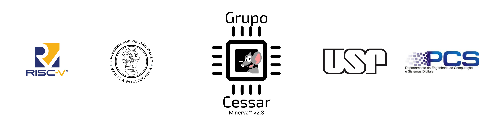
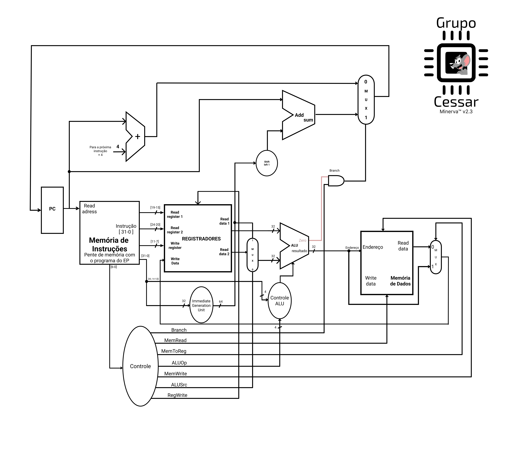
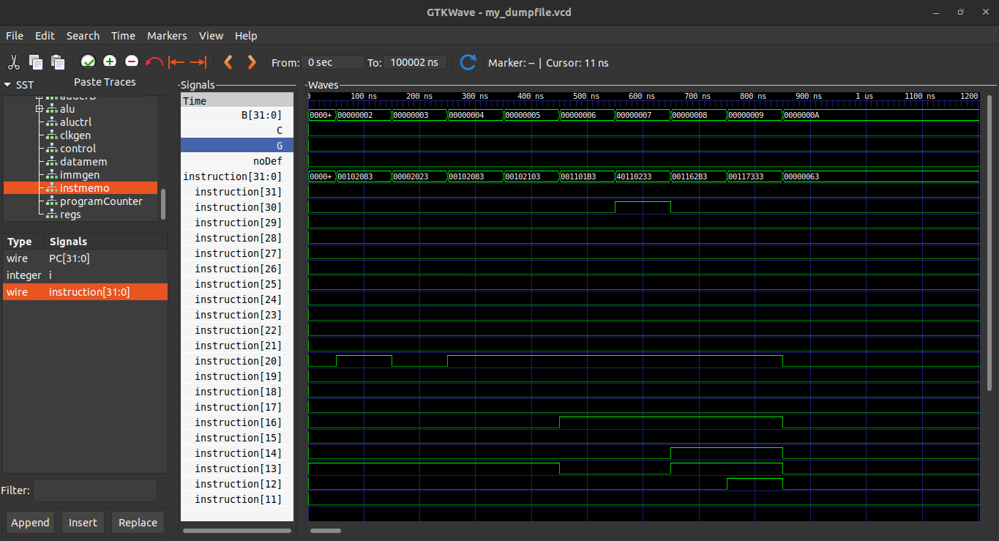

  

  
  
  

  
  
  
  

# Olá, bem-vindo ao repositório do grupo 3 (Grupo Cessar)!

Oi, tudo bem? Nós somos alunos do 1° ano de Engenharia de Computação da Escola Politécnica da USP no ano de 2022. 
Os integrantes do grupo são: Celso Tadaki Sinoka, Henrique Gregory Gimenez, João Felipe de Souza Melo e Lucas Suzin Bertan. Nós compomos o grupo 3 da disciplina PCS-3115 (Sistemas Digitais I).
Neste repositório você encontrará uma implementação de um processador com a arquitetura RISC-V na linguagem de descrição de hardware Verilog. O objetivo final deste projeto consiste em aplicar esse processador para rodar um jogo de advinhação, que foi desenvolvido como exercício em uma disciplina anterior (MAC2166 - Introdução à Computação).
Os resultados da simulação desse programa, assim como sua implementação no RISC-V, estão na pasta da Instruction Memory. Vai lá conferir :)

Abaixo você poderá ver um diagrama detalhado que descreve o funcionamento do circuito:

## Instruções
As instruções que o processador feito pelo grupo utiliza são:
|  Instrução  | Tipo |  Descrição |
|-------------|---|---|
| add  | R  | Soma dois registradores (rs1 e rs2) e armazena o resultado no registrador rd  |
| sub   | R | Subtrai dois registradores (rs1 e rs2) e armazena o resultado no registrador rd  |
| and | R  | Faz a operação lógica and bitwise (bit a bit) entre dois registradores (rs1 e rs2) e armazena o resultado no registrador rd  |
| or | R  | Faz a operação lógica or bitwise (bit a bit) entre dois registradores (rs1 e rs2) e armazena o resultado no registrador rd   |
| lw (load word) | S  | carrega uma palavra da Memória de Dados da posição rs1 + offset e armazena o valor lido no registrador rd |
| sw (storage word) |  I | armazena uma palavra do registrador rs2 na posição da Memória de Dados rs1 + offset |
| beq (branch if equal) |  B | Compara o conteúdo dos registradores rs2 e rs1. Caso eles sejam iguais (a subtração entre os dois tem resultado 0), o Program Counter, que marca a linha atual na Instruction Memory, é setado para PC atual + offset  |

Abaixo estão a estrutura de cada tipo de instrução:

  

## Simulação
Para simular o nosso código, usamos o Icarus Verilog e o GTKWave.
Abaixo estão os ícones com os links para o site do Icarus Verilog e do GTKWave, contendo as instruções para a instalação.

  
  

Os comandos para rodar são:

``
iverilog risc-v.v risc-v_TB.v -Wall
``

  ⚠️ ATENÇÃO ⚠️

  Caso ocorra algum erro ao importat algum arquivo, um erro provável é que o Icarus Verilog considerou o caminho do workspace como padrão de início do navegação até um arquivo. Caso tenha problema com isso, ao baixar, substitua as pasta contidas nesse arquivo por estas contendo os imports levando em consideração a pasta do arquivo como padrão para importação

  

Um arquivo nomeado "a.out" será gerado e, a seguir, deve ser executado.

``
./a.out
``

O arquivo com as ondas simuladas serão escritas no arquivo 'my_dumpfile.vcd", sendo agora necessário visualizá-las no GTKWave.

``
gtkwave my_dumpfile.vcd
``

Por fim, uma tela parecida com essa aparecerá:

  

## Considerações finais

Em cada uma das pastas, você encontrará os módulos utilizados para essa implementação, bem como seus respectivos testbenches. Além disso, há comentários nos códigos que explicam o comportamento de tais componentes.

Espero que você se divirta bastante navegando pelos códigos e possa aprender mais ainda sobre Sistemas Digitais! :)

## Referências
Instruction Set oficial do RISC-V: https://riscv.org/wp-content/uploads/2017/05/riscv-spec-v2.2.pdf

Computer Organization and Design - RISC-V Edition: http://home.ustc.edu.cn/~louwenqi/reference_books_tools/Computer%20Organization%20and%20Design%20RISC-V%20edition.pdf

Guia Prático RISC-V 1.0.0: http://riscvbook.com/portuguese/guia-pratico-risc-v-1.0.0.pdf

Site do professor Bruno Albertini: https://balbertini.github.io/pages/sobre-pt_BR.html
