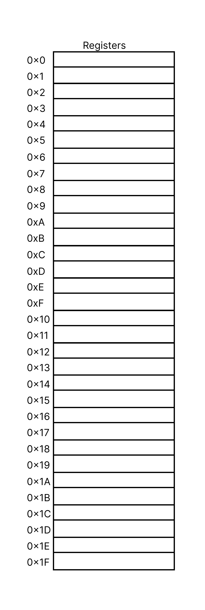

# Program Counter

O Program Counter é um registrador de 32 bits que guarda a posição de leitura atual da Memória de Instruções, ou seja, marca qual instrução é a instrução atual.

Exemplo: para fazer um loop (while, for na linguagem C), esse Program Counter pode retornar uma sequência de números de forma circular.

# Registradoes

O RISC-V de 32 bits possui 32 registradores de 32 bits.

Abaixo, uma representação deles:

