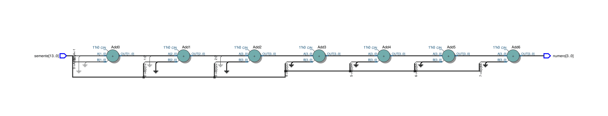

# Gerador de números aleatórios

Esta unidade foi feita pensando em implementar a geração de senhas pseudo-aleatórias na Memória de Dados do processador.

Por outro lado, preferimos deixar a solução 100% RISC-V, sem adaptações externas. Por completude, deixamos o circuito sintetizado e o código aqui.

 
